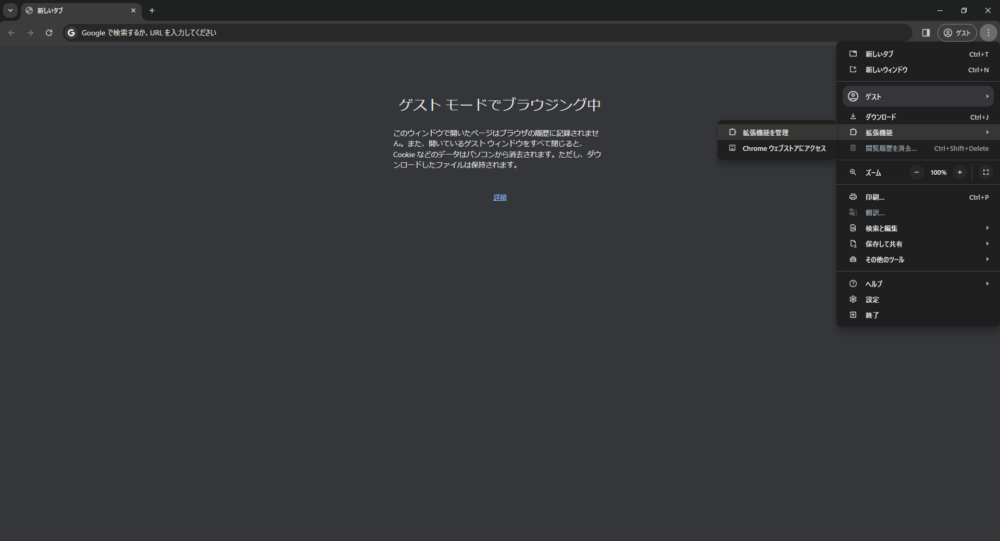
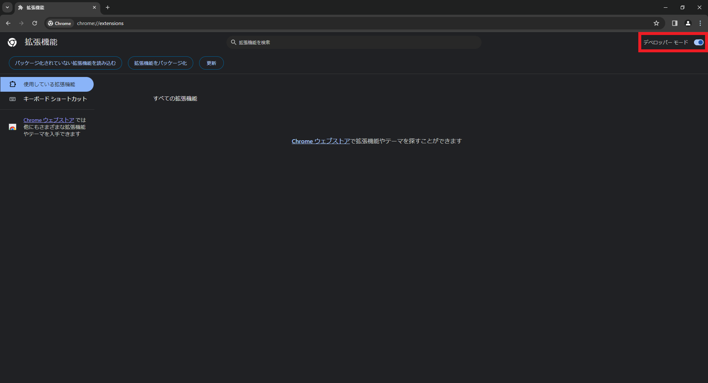
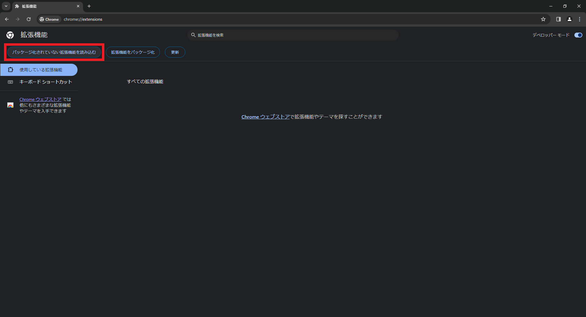
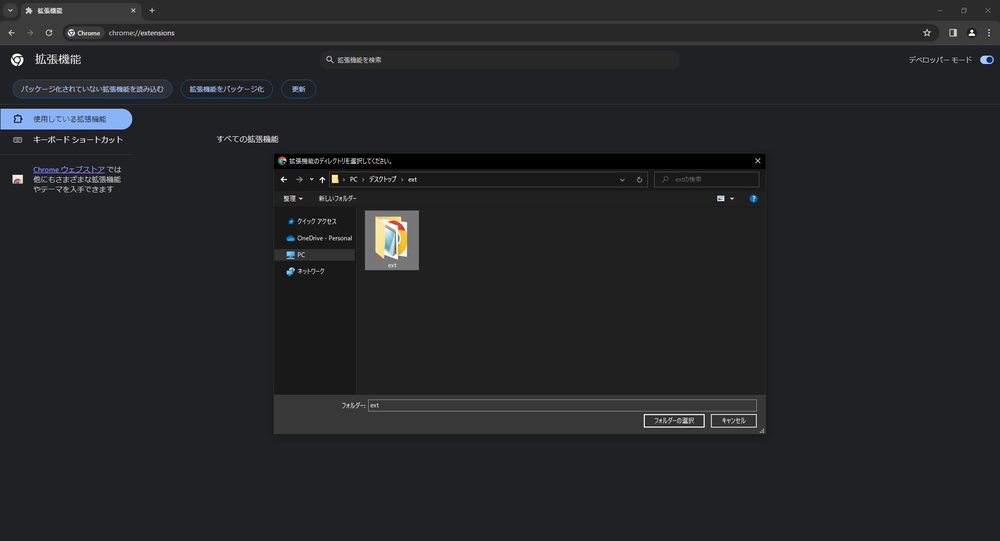
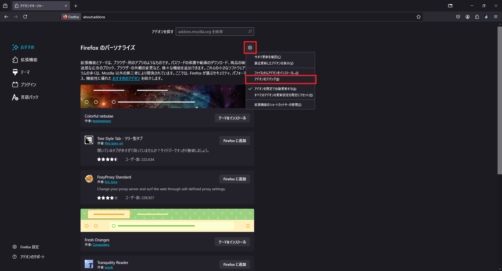
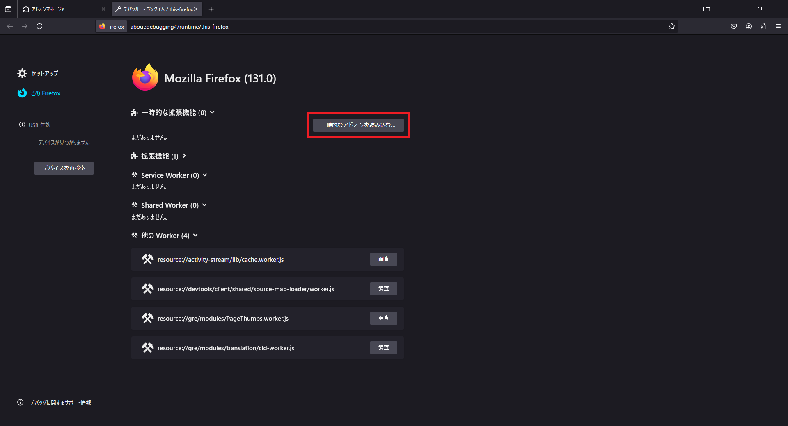

# Phishing Detector for Chrome Extension

[<u>README in English</u>](./README-en.md)

## インストール方法

### Google Chrome

1. 本リポジトリの [Releases](https://github.com/alpherg0221/PhishDetector/releases) から`ext.zip`をダウンロードして展開
2. Google Chromeで右上のメニューボタン (︙) から 「拡張機能」 → 「拡張機能を管理」 を選び、拡張機能の管理画面を開く

   
4. 右上にある「デベロッパーモード」ボタンを押して、デベロッパーモードを有効にする

   
5. 「パッケージ化されていない拡張機能を読み込む」をクリックし、展開したディレクトリの中の`ext`を選択

   

   

### FireFox

```
INFO: FireFox版は簡単な動作テストしかおこなっていないため、正しく動作しない場合があります。
```

1. 本リポジトリの [Releases](https://github.com/alpherg0221/PhishDetector/releases) から`ext-firefox.zip`をダウンロードして展開
2. FireFoxで右上のメニューから「アドオンとテーマ」を選択して、アドオンマネージャー画面に移動する
3. アドオンマネージャー画面で、「歯車アイコンのボタン」 → 「アドオンをデバッグ」と選択し、デバッガー画面に進む
   
   
4. デバッガー画面で「一時的なアドオンを読み込む」を押し、ダウンロードした`ext-firefox.zip`を選択する

   

## 使用方法

### 情報提供
インストール時に表示される画面か、画面右上のアイコンから開けるポップアップ画面で、
検出時の情報を開発者に送信することができます。
送信された情報は検出精度の改善に使用されます。

### フィッシングページの検出
パスワード入力フォームがあるページにアクセスすると、自動で検出処理を実行します。<br>
フィッシングサイトを検出すると、警告画面が表示されます。

### 誤検出の報告
警告画面が表示されている状態で「誤検出を報告」ボタンを押すことで、
誤検出を開発者に報告できます。

### 検出漏れの報告
フィッシングページが表示されている状態で画面右上のアイコンからポップアップを開き、
「このページをフィッシングとして報告」 ボタンを押すことで、検出漏れを開発者に報告できます。


## Block list / Allow list
本拡張機能には、Block listとAllow listがあります。
これらのリストに追加されているドメインのページにアクセスした場合には、
ページのコンテンツ情報を使用したフィッシングページの検出処理はおこなわれません。

### Block list
以下の場合にページのドメインがBlock listに追加されます。
- フィッシングページを検出したとき
- ポップアップから、フィッシングページを報告したとき

### Allow list
以下の場合にページのドメインがAllow listに追加されます。
- 警告画面から誤検出を報告したとき
- 警告を無視してページにアクセスしたとき

### リストの管理
ポップアップにある「Block list」「Allow list」ボタンから各リストの管理画面を表示できます。
現在はリストにあるドメインの削除のみおこなうことができます。
