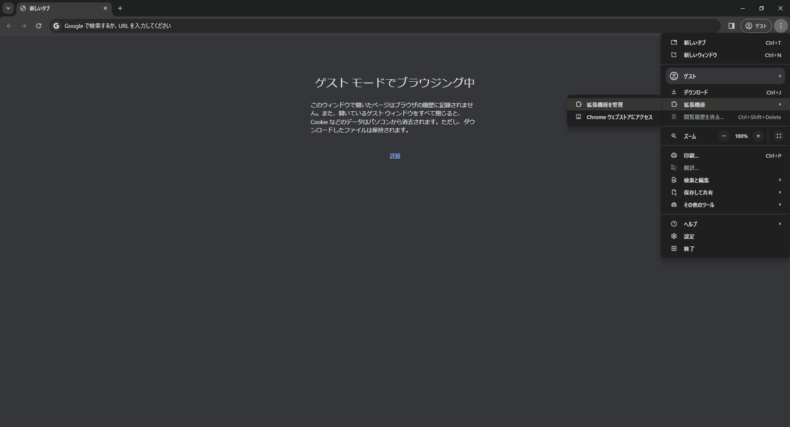
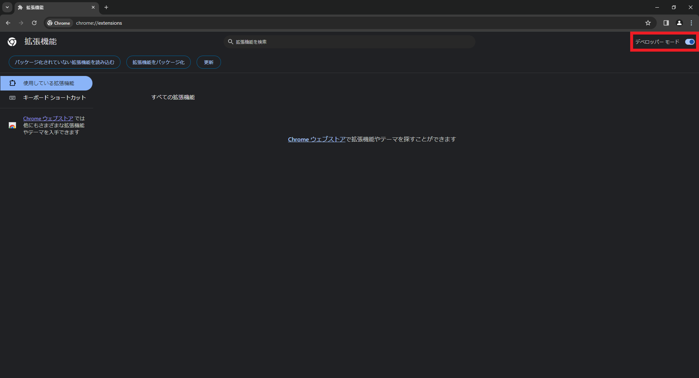
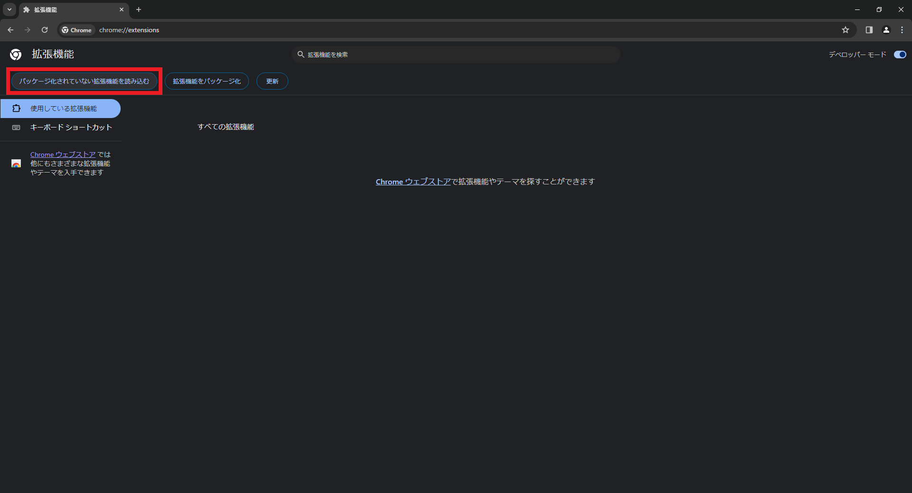
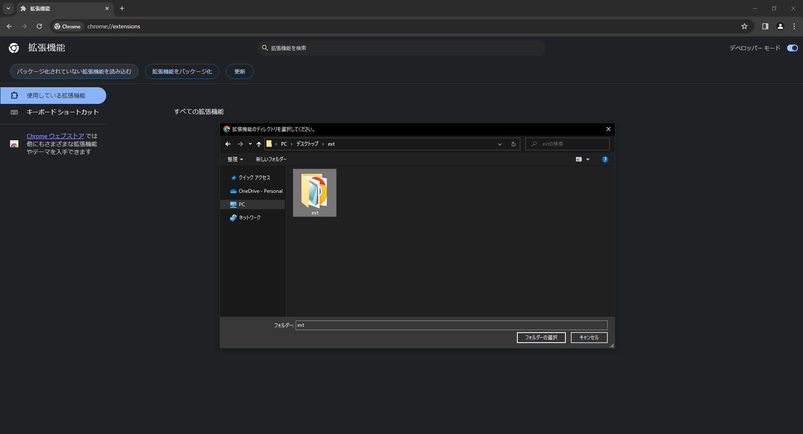

# Phishing Detector for Chrome Extension

## How to install

1. 本リポジトリの [Releases](https://github.com/alpherg0221/PhishDetector/releases) から`ext.zip`をダウンロードして展開
2. Google Chromeで右上のメニューボタン (︙) から 「拡張機能」 → 「拡張機能を管理」 を選び、拡張機能の管理画面を開く
   
3. 右上にある「デベロッパーモード」を有効にする
   
4. 「パッケージ化されていない拡張機能を読み込む」をクリックし、展開したディレクトリの中にある`ext`を選択
   
   

## How to use

パスワード入力フォームがあるページにアクセスすると、自動で検出処理を実行します。 
フィッシングサイトを検出すると、警告画面が表示されます。